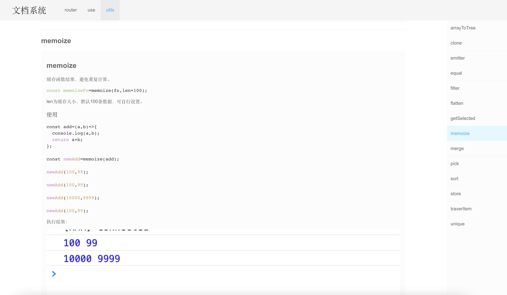

# 文档系统

将markdown文件转为html页面展示，只需将md文件放入指定目录，即可在页面展示出文档内容。



[在线demo](http://ihuxy.com:8010/)

## 获取md文件路径

通过`require.context`获取文件名称。

``` javascript
const listFiles=()=>require.context('../doc',true,/^\.\/(.+)\.md$/).keys().map(name=>({name:name.replace(/^\.\/(.+)\.md$/,'$1')}));

```

使用：

``` javascript
const files=listFiles();

```

## 菜单

将获取到的文件名列表作为菜单，根据路由query `name=filename`来跳转路由。

``` javascript
const renderMenu=(menu,inputPath)=>{
  return menu.map(item=>{
    const {path,name,open,children}=item;
    const active=name===getParams(inputPath).params?.name;
    if(children?.length){
      return <li key={path||name} className={open?'open':''}>
        <Link to={{query:{name}}} className={active?'active':''} preventDefault>
          <span>{name}</span>
        </Link>
        <ul>{renderMenu(children,inputPath)}</ul>
      </li>;
    }
    return <li key={path||name}>
      <Link to={{query:{name}}} className={active?'active':''} stopPropagation>
        <span>{name}</span>
      </Link>
    </li>;
  });
};

```

## md转html

通过文件名列表异步加载文件内容.

通过`marked`将md文件转为html，并通过`highlight.js`为md文件添加样式，高亮代码块。

### marked + highlight.js

``` javascript
import marked from 'marked';
import hljs from 'highlight.js';
import 'highlight.js/styles/atom-one-dark.css';
marked.setOptions({
  renderer:new marked.Renderer(),
  gfm:true,
  tables:true,
  breaks:false,
  pedantic:false,
  sanitize:false,
  smartLists:true,
  smartypants:false,
  highlight:code=>{
    return hljs.highlightAuto(code).value;
  },
});

```

### renderContext

``` javascript
const Index=({name})=>{
  const [context,setContext]=useState('');
  useEffect(()=>{
    const getContext=async ()=>{
      try{
        const context=(await import(`../../doc/${name}.md`))?.default;
        const newContext=await replacePath(context);
        setContext(marked(newContext));
      }catch(err){
        setContext(err?.message);
      }
    };
    getContext();
  },[]);

  return <div className="content">
    {str2React(context)}
    {!context&&<Spinner global />}
  </div>;
};

```

## 路由跳转和锚点跟随

### 页面路由

``` javascript
const routers=[
  {
    path:'/',
    name:'文档',
    icon:'HomeOutlined',
    component:()=>import('@app/components/renderMd'),
  },
  {
    path:'/404',
    name:'404',
    component:props=><span>{props.inputPath} is not found</span>,
    hideMenu:true,
  },
];

```

通过路由query跳转，例如：`/doc?name=filename`。

### 页面渲染

为每个页面添加ref来获取当前页面的`offsetTop`值，跳转时将页面滚动到对应的位置即可。

``` javascript
const refList=Object.keys(items.current).map(key=>({name:key,offsetTop:items.current[key]?.offsetTop??0}));

```

### 锚点跟随

``` javascript
window.addEventListener('scroll',debounce(scrollToAnchor),false);

```

监听滚动（可对滚动添加防抖函数），滚动到对应文档位置区域时，改变其路由query值。

``` javascript
const scrollToAnchor=()=>{
  if(!isScrolling.current){
    const offsetTops=sort(Object.keys(items.current).map(key=>({name:key,offsetTop:items.current[key]?.offsetTop??0})),'offsetTop',true);
    const name=offsetTops.find(item=>scrollTop()>=item.offsetTop)?.name;
    if(currentName.current!==name){
      currentName.current=name;
      router.push({query:{name}});
    }
  }
};

```
