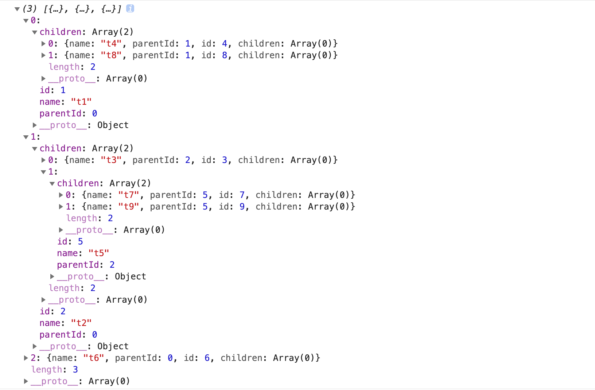
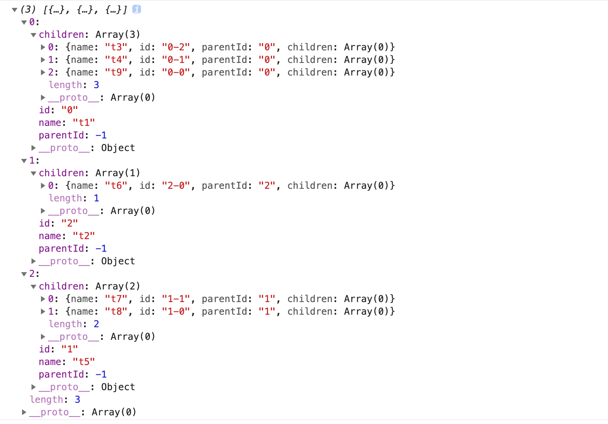
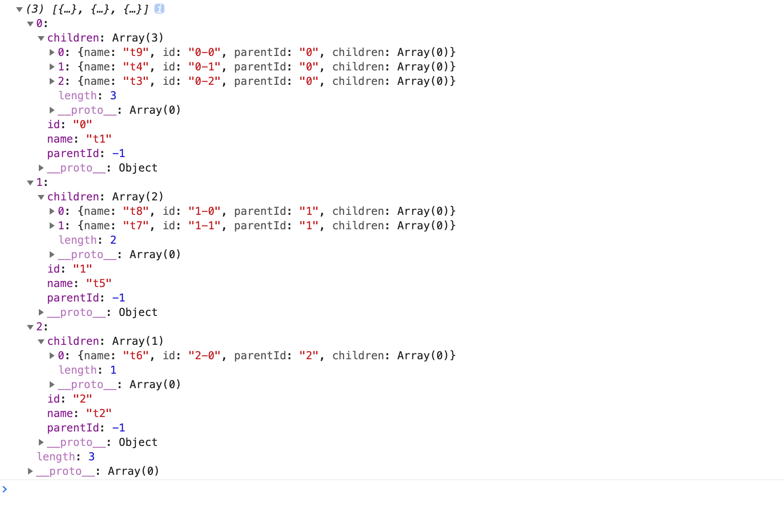
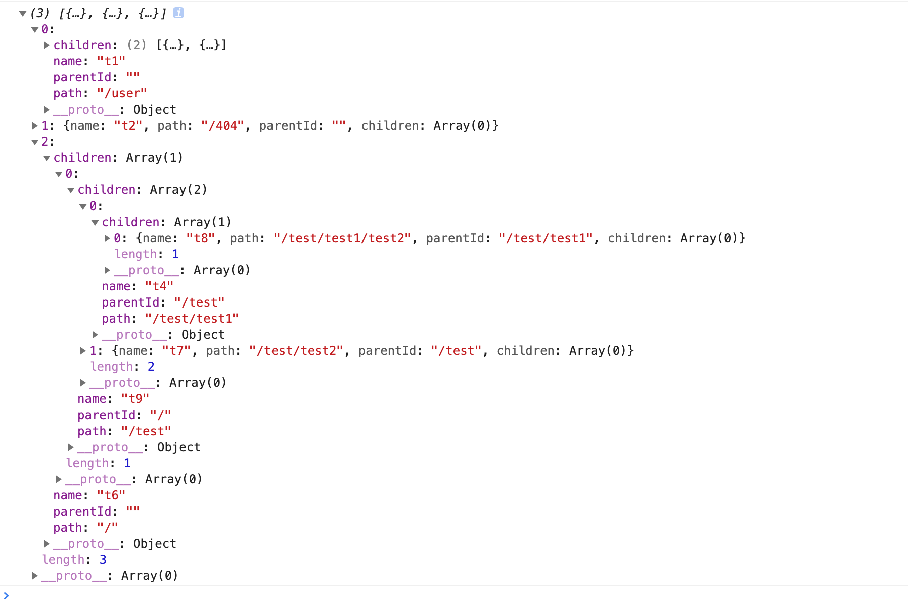

## arr2Tree

数组转为树类型。通过数组元素存在的一些关联（如parentId等），将其转换为树形结构。

```javascript
const tree=arr2Tree(callback)(arr,idKey,childKey);

```

当我们的数组中不存在parentId属性时，可以通过callback回调函数来处理，将元素间的关系转换为parentId返回。

idKey即数组唯一标识符，默认为id。childKey为子级字段名，默认为children。

### 使用

带有parentId数组示例：

```javascript
const arr=[
  {
    name:'t1',
    parentId:0,
    id:1,
  },
  {
    name:'t2',
    parentId:0,
    id:2,
  },
  {
    name:'t3',
    parentId:2,
    id:3,
  },
  {
    name:'t4',
    parentId:1,
    id:4,
  },
  {
    name:'t5',
    parentId:2,
    id:5,
  },
  {
    name:'t6',
    parentId:0,
    id:6,
  },
  {
    name:'t7',
    parentId:5,
    id:7,
  },
  {
    name:'t8',
    parentId:1,
    id:8,
  },
  {
    name:'t9',
    parentId:5,
    id:9,
  },
];

```

```javacsript
import {arr2Tree} from '@huxy/utils';

const a2t=arr2Tree();

const tree=a2t(arr);

```

结果：



### callback处理

不带parentId数组，但通过属性可以找到其层级规律的，可以使用callback函数转为parentId，callback返回当前数组元素作为参数。

例如数组：

```javacsript
const arr=[
  {
    name:'t1',
    id:'0',
  },
  {
    name:'t2',
    id:'2',
  },
  {
    name:'t3',
    id:'0-2',
  },
  {
    name:'t4',
    id:'0-1',
  },
  {
    name:'t5',
    id:'1',
  },
  {
    name:'t6',
    id:'2-0',
  },
  {
    name:'t7',
    id:'1-1',
  },
  {
    name:'t8',
    id:'1-0',
  },
  {
    name:'t9',
    id:'0-0',
  },
];

```
我们可以转换一下：

```javacsript
const arr2TreeById=(data,idKey='id',childKey='children')=>arr2Tree(item=>{
  const id=item[idKey];
  const parentArr=id.match(/\S+(?=-\S+)/);
  return parentArr?.[0]||-1;
})(data,idKey,childKey);


import {arr2TreeById} from '@huxy/utils';

const tree=arr2TreeById(arr);

```

执行结果：



如果需要对树排序，可使用 `_sort` 自行处理，例如，对上面的树按照id升序排序：

`const tree=_sort(arr2TreeById(arr,'id'));`

执行结果：



### path路径数组转为tree结构

```javacsript
const arr=[
  {
    name:'t1',
    path:'/user',
  },
  {
    name:'t2',
    path:'/404',
  },
  {
    name:'t3',
    path:'/user/login',
  },
  {
    name:'t4',
    path:'/test/test1',
  },
  {
    name:'t5',
    path:'/user/signup',
  },
  {
    name:'t6',
    path:'/',
  },
  {
    name:'t7',
    path:'/test/test2',
  },
  {
    name:'t8',
    path:'/test/test1/test2',
  },
  {
    name:'t9',
    path:'/test',
    parentId:'/',
  },
];

import {arr2TreeByPath} from '@huxy/utils';

const tree=arr2TreeByPath(arr);

```

执行结果：




