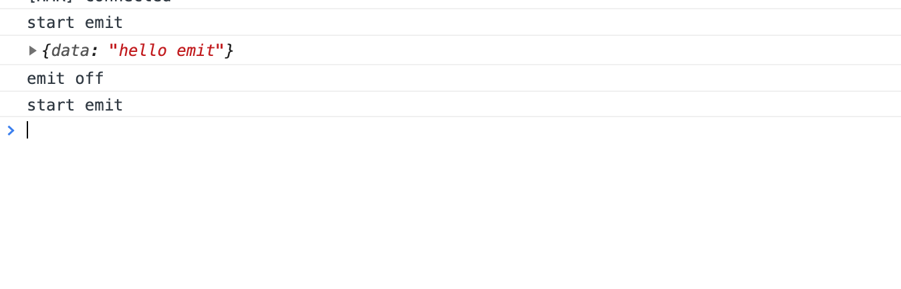

## emitter

订阅发布模式，监听数据变化并执行对应操作。

```javascript
const {on,emit,off}=emitter();

on(name,cb)

emit(name,data)

off(name,cb=null)

```

- on：订阅事件
- emit：发布事件
- off：销毁订阅

### 使用

```javascript
const testEmit=()=>{
  console.log('start emit');
  emit('test-name',{data:'hello emit'});
};

on('test-name',result=>{
  console.log(result);
});

const offEmit=()=>{
  console.log('emit off');
  off('test-name');
};

setTimeout(testEmit,2000);

setTimeout(offEmit,3000);

setTimeout(testEmit,4000);

```

执行结果：




