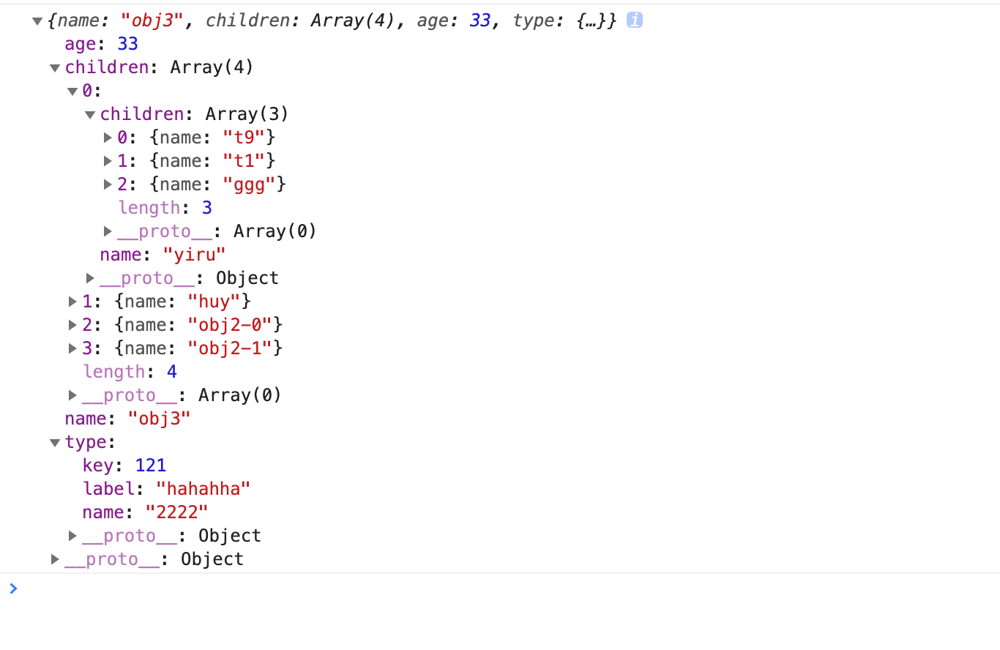

## merge

对象合并。

```javascript
const newData=merge(data1,data2,...);

```

### 使用

```javascript
const obj1={
  name:'cccc',
  children:[
    {
      name:'yiru',
      children:[
        {
          name:'t9',
        },
        {
          name:'t1',
        },
        {
          name:'ggg',
        },
      ],
    },
    {
      name:'huy',
    },
  ],
};
const obj2={
  name:'cccc',
  children:[
    {
      name:'obj2-0',
    },
    {
      name:'obj2-1',
    },
  ],
  age:18,
};
const obj3={
  name:'obj3',
  age:33,
  type:{
    name:'2222',
    key:121,
    label:'hahahha',
  },
};

const newObj=merge(obj1,obj2,obj3);

console.log(newObj);

```

结果：




