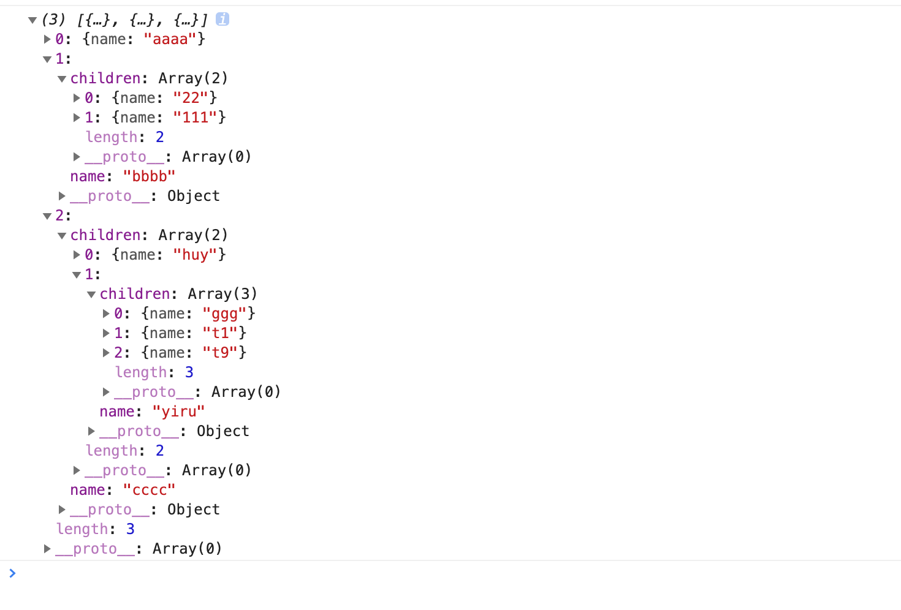

## sort

对数组或树结构排序。

```javascript
const newTree=_sort(data,key='name',childKey='children',desc=false);

```

key是需要排序的字段名，默认name。childKey为子级字段名，默认为children。desc是否为降序排列，默认false。

### 使用

对树排序：

```javascript
const arr=[
  {
    name:'bbbb',
    children:[
      {
        name:'111',
      },
      {
        name:'22',
      },
    ],
  },
  {
    name:'cccc',
    children:[
      {
        name:'yiru',
        children:[
          {
            name:'t9',
          },
          {
            name:'t1',
          },
          {
            name:'ggg',
          },
        ],
      },
      {
        name:'huy',
      },
    ],
  },
  {
    name:'aaaa',
  },
];

const newArr=_sort(arr);

```

结果：




