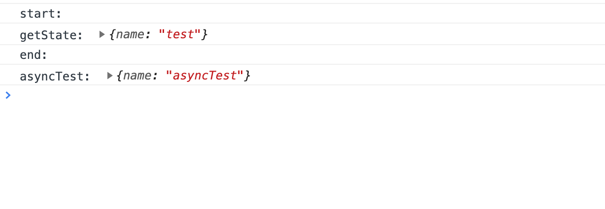

## store

状态管理，提供 `getState,setState,subscribe` 来获取和更新状态。subscribe使用了订阅发布模式，用于异步更新。

```javascript
const {getState,setState,subscribe}=createStore();

getState(key)

setState(state)

const off=subscribe(key,cb)

```

- getState：获取数据
- setState：设置数据
- subscribe：获取异步数据，回调函数执行更新事件，返回off销毁订阅事件函数。

### 使用

```javascript
console.log('start:');
setState({
  testData:{
    name:'test',
  },
});
const testGet=()=>{
  const result=getState('testData');
  console.log('getState: ',result);
};

const asyncFn=()=>{
  setTimeout(()=>{
    setState({
      asyncTest:{
        name:'asyncTest',
      },
    });
  },2000);
};

subscribe('asyncTest',result=>{
  console.log('asyncTest: ',result);
});

testGet();
asyncFn();
console.log('end:');

```

执行结果：




