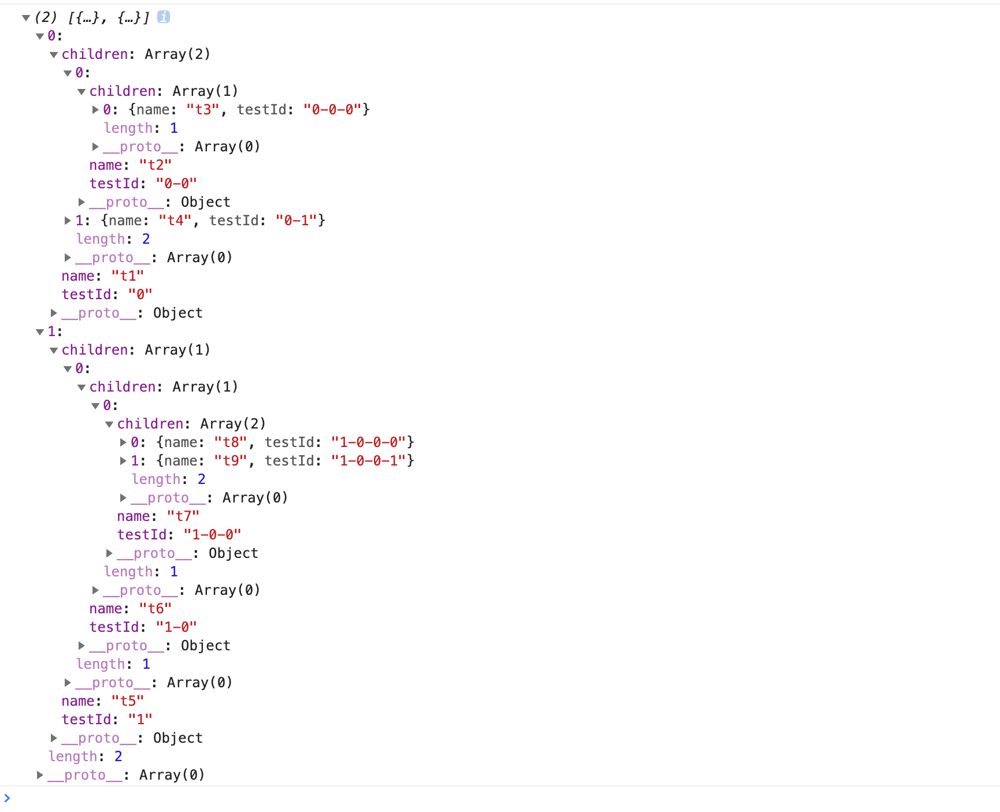

## traverItem

遍历树，并执行我们想要的操作。

```javascript
const newTree= traverItem(callback)(tree,childKey);

const callback =(item,parent,index)=>{
  ...
};

```
childKey为子级字段名，默认为children。

callback回调函数，返回参数为当前元素对象，父级信息以及当前数组下标。

### 使用

例如给树添加id。

```javascript
const arr=[
  {
    name:'t1',
    children:[
      {
        name:'t2',
        children:[
          {
            name:'t3',
          },
        ],
      },
      {
        name:'t4',
      },
    ],
  },
  {
    name:'t5',
    children:[
      {
        name:'t6',
        children:[
          {
            name:'t7',
            children:[
              {
                name:'t8',
              },{
                name:'t9',
              },
            ],
          },
        ],
      },
    ],
  },
];

```

```javacsript
import {traverItem} from '@huxy/utils';

const cb=(item,parent,index)=>{
  item.testId=[...parent.map(v=>v['@@index']),index].join('-');
  return item;
};

const newTree=traverItem(cb)(arr);

```

结果：



我们可以通过遍历树callback函数来执行我们想要的树结构操作。


