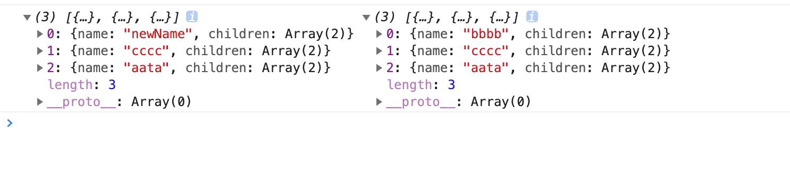

## clone

深拷贝。

```javascript
const newData=clone(data);

```

### 使用

```javascript
const arr=[
  {
    name:'bbbb',
    children:[
      {
        name:'111',
      },
      {
        name:'22t',
      },
    ],
  },
  {
    name:'cccc',
    children:[
      {
        name:'yiru',
        children:[
          {
            name:'t9',
          },
          {
            name:'t1',
          },
          {
            name:'ggg',
          },
        ],
      },
      {
        name:'huy',
      },
    ],
  },
  {
    name:'aata',
    children:[
      {
        name:'444',
      },
      {
        name:'555',
      },
    ],
  },
];

const newArr=clone(arr);
arr[0].name='newName';

console.log(arr,newArr);

```

结果：




