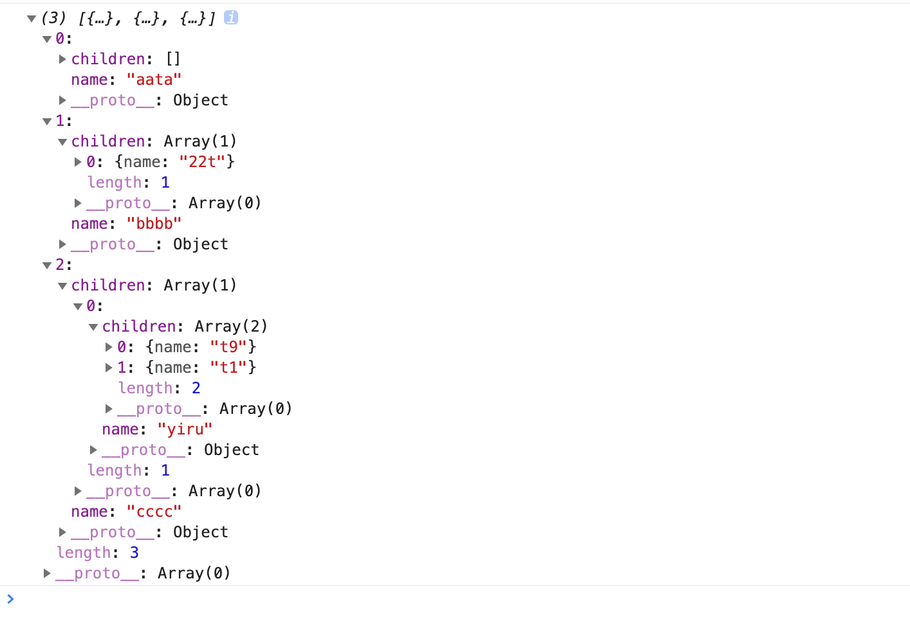
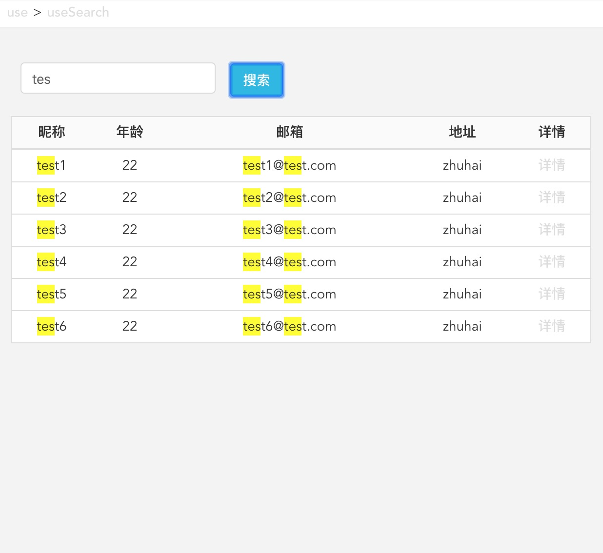

## filter

对数组或树结构过滤。

```javascript
const newTree=filterList(data,keyword,str2Dom,fields='name',idKey='id',childKey='children',exact=false);

```

keyword是过滤匹配值。str2Dom是高亮匹配值，默认nulll不高亮。fields是需要作匹配的字段名列表，默认name。idKey即数组唯一标识符，默认为id。childKey为子级字段名，默认为children。exact是否为绝对匹配，默认false模糊匹配。

### 使用

对树排序：

```javascript
const arr=[
  {
    name:'bbbb',
    children:[
      {
        name:'111',
      },
      {
        name:'22t',
      },
    ],
  },
  {
    name:'cccc',
    children:[
      {
        name:'yiru',
        children:[
          {
            name:'t9',
          },
          {
            name:'t1',
          },
          {
            name:'ggg',
          },
        ],
      },
      {
        name:'huy',
      },
    ],
  },
  {
    name:'aata',
    children:[
      {
        name:'444',
      },
      {
        name:'555',
      },
    ],
  },
];

const newArr=filterList(arr,'t',null,['name'],'name');

```

结果：



可用于树结构的模糊搜索。



[useSearch](https://github.com/ihuxy/doc/blob/master/use/useSearch.md)


