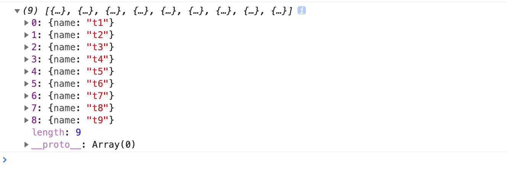

## flatten

平铺一个树结构对象。

```javascript
const newArr=flatten(arr,childKey);

```

childKey为子级字段名，默认为children。

### 使用

平铺树

```javascript
const arr=[
  {
    name:'t1',
    children:[
      {
        name:'t2',
        children:[
          {
            name:'t3',
          },
        ],
      },
      {
        name:'t4',
      },
    ],
  },
  {
    name:'t5',
    children:[
      {
        name:'t6',
        children:[
          {
            name:'t7',
            children:[
              {
                name:'t8',
              },{
                name:'t9',
              },
            ],
          },
        ],
      },
    ],
  },
];

const newArr=flatten(arr);

```




