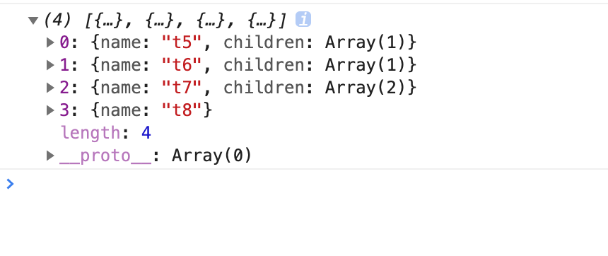

## getSelected

获取我们选中节点的信息，包括父级信息。

```javascript
const selected=getSelected(tree,id,idKey,childKey);


```

id是我们选中的id值，idKey即数组唯一标识符，默认为id。childKey为子级字段名，默认为children。

例如获取当前路由的信息，可用于作为面包屑值。

```javascript
const arr=[
  {
    name:'t1',
    children:[
      {
        name:'t2',
        children:[
          {
            name:'t3',
          },
        ],
      },
      {
        name:'t4',
      },
    ],
  },
  {
    name:'t5',
    children:[
      {
        name:'t6',
        children:[
          {
            name:'t7',
            children:[
              {
                name:'t8',
              },{
                name:'t9',
              },
            ],
          },
        ],
      },
    ],
  },
];

const selected=getSelected(arr,'t8','name');

```

返回是从父级到选中节点的数组。




