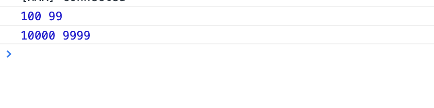

## memoize

缓存函数结果，避免重复计算。

```javascript
const memoizeFn=memoize(fn,len=100);

```

len为缓存大小，默认100条数据，可自行设置。

### 使用

```javascript
const add=(a,b)=>{
  console.log(a,b);
  return a+b;
};

const newAdd=memoize(add);

newAdd(100,99);

newAdd(100,99);

newAdd(10000,9999);

newAdd(100,99);

```

执行结果：




