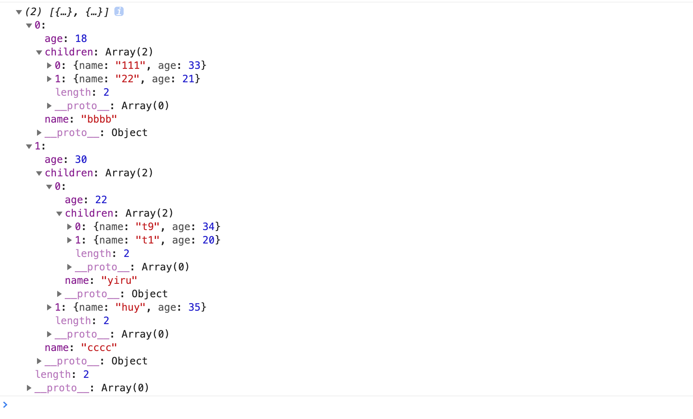

## unique

对数组或树结构去重。

```javascript
const newTree=_unique(data,key='id',childKey='children');

```

key是需要去重的字段名，默认id。childKey为子级字段名，默认为children。

### 使用

对树排序：

```javascript
const arr=[
  {
    name:'bbbb',
    age:18,
    children:[
      {
        name:'111',
        age:33,
      },
      {
        name:'22',
        age:21,
      },
      {
        name:'111',
        age:44,
      },
    ],
  },
  {
    name:'cccc',
    age:30,
    children:[
      {
        name:'yiru',
        age:22,
        children:[
          {
            name:'t9',
            age:34,
          },
          {
            name:'t1',
            age:20,
          },
          {
            name:'t9',
            age:29,
          },
        ],
      },
      {
        name:'huy',
        age:35,
      },
      {
        name:'yiru',
        age:32,
        children:[
          {
            name:'ttt',
            age:23,
          },
        ],
      },
    ],
  },
  {
    name:'cccc',
    age:40,
  },
];

const newArr=_unique(arr,'name');

```

结果：




